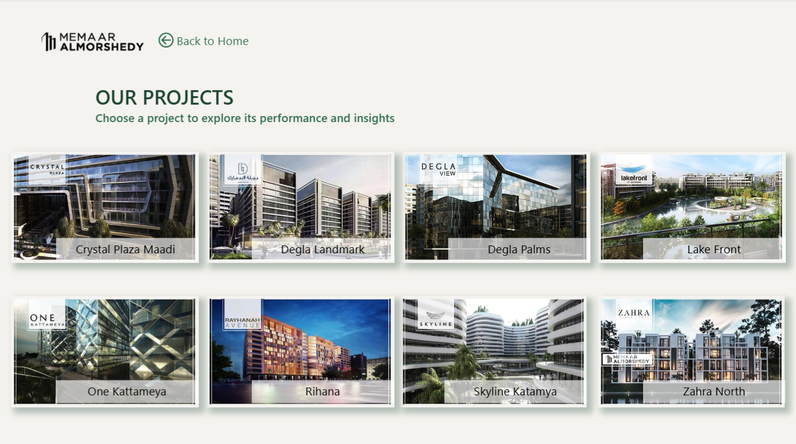

# 🏢 Real Estate Collection Analysis | Power BI

## 📌 Project Overview

An interactive Power BI dashboard developed to analyze installment collections and payment performance across multiple real estate projects.

The dashboard provides insights into sales, installments, collections, outstanding balances, payment methods, and project performance to support data-driven decision making.

---

## 🎯 Business Questions

- How many units have been sold across each project?
- What is the project completion percentage?
- How much has been collected versus outstanding?
- What is the collection rate?
- How does collection performance change over time?
- What is the outstanding balance for Cash vs. Bank payments?
- Which banks have the highest outstanding balances?
- How does installment performance vary across projects?

---

## 🛠️ Tools & Technologies

- **Power BI**
- **Power Query**
- **DAX**
- **Data Modeling**
- **Data Cleaning & Transformation**
- **Star Schema**
- **Excel**

---

## 🔄 Data Preparation & ETL

Key transformation steps included:

- Removing control and summary rows.
- Unpivoting installment columns into a structured installment-level table.
- Standardizing dates, currencies, contract numbers, and bank names.
- Classifying installment statuses into:
  - **PAID**
  - **DUE - NOT PAID**
  - **NOT DUE**
- Separating Cash and Bank payment methods.
- Creating a clean analytical model for reporting.

---

## 🧩 Data Model

The Power BI model follows a star-schema approach with:

- **Fact_Installment**
- **Dim_Sale**
- **Dim_Project**
- **Dim_PaymentMethod**
- **Dim_Date**

The **Sale Contract Number** was used as the main business key for identifying each sale.

---

## 📊 Key KPIs

- Sold Units
- Sold %
- Project Completion %
- Issued Invoices
- Collected Invoices
- Outstanding Invoices
- Collection Rate
- Invoiced Amount
- Amount Collected
- Outstanding Balance
- Cash Outstanding
- Bank Outstanding

---

## 📑 Dashboard Pages

### 🏠 Home

Project navigation and high-level overview.


### 📊 Global Summary

Overall performance across projects, including collections, outstanding balances, and project completion.


### 📅 Date Summary

Analysis of collection activity over time.


### 🏢 Projects

Project-level overview and performance analysis.



### 📋 Overall Project

Detailed installment analysis across projects.


### 🏦 Bank Project

Analysis of bank-financed collections and outstanding balances.


### 💵 Cash Project

Analysis of cash collections and outstanding balances.


### 🏦 Bank-Wise Project

Comparison of outstanding balances across different banks.


---

## 💡 Key Insights

The dashboard enables stakeholders to:

- Monitor collection performance across projects.
- Identify outstanding installment balances.
- Compare Cash and Bank payment performance.
- Track project completion.
- Analyze collection trends over time.
- Identify banks with higher outstanding balances.
- Compare installment performance across projects.

---

## 📁 Repository Structure

```text
real-estate-collection-analysis-powerbi/
│
├── Memaar AlMorshedy Analysis.pbix
│
├── Screenshots/
│   ├── Home.png
│   ├── Global Summary.png
│   ├── Date Summary.png
│   ├── Projects.png
│   ├── Overall Project.png
│   ├── Bank Project.png
│   ├── Cash Project.png
│   └── Bank Wise Project.png
│
└── README.md
```

---

## 👩‍💻 Author

**Mariam Ali Hassan**

Junior Data Analyst | Power BI | SQL | Excel | Python

Focused on Data Analysis, Business Intelligence, Data Visualization, and Data Modeling.
